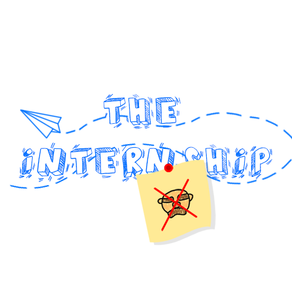

# Ludum Dare 51

## The Internship

## Collaborators

- Elise - 3D Artist ([Art Station](https://www.artstation.com/nyandiacat))
- Léonard - 3D Artist ([Art Station](https://www.artstation.com/leonard_pineau))
- Zackary - 2D Artist
- Raphaël Fortin - Developper
- Nicolas Charette-Naud - Developper

## Instructions

5 minutes left before the end of the day ! It's the end of your internship, after that you'll be hired ! The boss ask you for a coffee every 10 seconds and you need to give him fast otherwise he will get more and more angry. Try to not get fired if you want the job !

## Controls

- WASD/Arrows to move
- E for action (get/give coffee)
- Avoid obstacles
- Survive 5 minutes. You will be fired if the boss gets too angry.

## Insights from development

The team was split across the globe. 3D artists were from France and Belgium. Developers and 2D artist from Canada (Québec).

At the beginning of the brainstorm, the idea was that someone ask for things every 10 seconds. After few minutes "someone" became a boss and the hero an intern. Léonard (3D artist) suggests that we use the TV show "The Office" as a source of inspiration.

When we start to think what the boss could ask for :

- Answer the phone
- Get packages at the door
- Prepare documents (computer)
- Do photocopies
- Bring coffee

We started by programming the coffee machine because we found this one funny ... a boss drinking coffee every 10 seconds.

24 hours after the begining of GameJam, we finished our MVP version of the game. Instead of adding more game mecanics, we decided to put more love in the design and details (For example putting a paper plane flying around in the office)

Elise and Léo did an awesome job ! The office was fully placed and a lot of assets were usable (without textures). Table, chairs, computer chairs, computers, coffee machine, fridge, closets, phones and printers.

Zackary designed many things that help to have a better comprehension of what's happening with the boss : icons, textures for particle system in the AngryBar, image of the boss asking coffee or being happy, game logo, etc.

Few hours before the end of the GameJam, Raphaël though it could be nice to have an ending condition (winning or losing). So he start working with Zack on a tutorial when the game starts while Nicolas work on a camera system to have a "end game screen".

**Loosing:** Camera with the boss in his office with the mention: "You're fired!"

**Winning:** Camera on the paper plane with the mention: "You're hired!".

1 or 2 hours before the end, the 3d team finish texturing, decorating putting lighting into the final released scene. It was really helpful that they were autonomous in Unity.

Finally, it was an awesome GameJam, we loved to work on that game and we hope you'll have pleasure to play our game. Don't hesitate to give us comments and feedback !